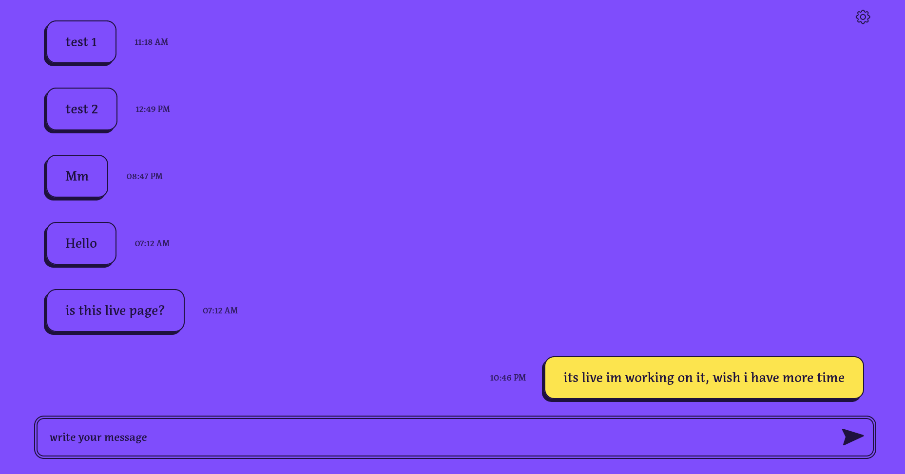

  <h1>Chat Anonymously</h1>
  
  

   None will know who you are but
don't kill anyone
  

<h4>
    <a href="https://chat-25704.web.app/" target="_blanl">View Demo</a>
    </h4>

 

 
  

<!-- TechStack -->

### :space_invader: Tech Stack

- React 18.1.0
- firebase 9.9.0
- Feature 3

## :handshake: Contact

Anjit pariyar - [Instagram](https://www.instagram.com/limbo_anj/) - anjitpariyar@gmail.com

Portfolio: [https://anjitpariyar.com.np/](https://anjitpariyar.com.np/)
